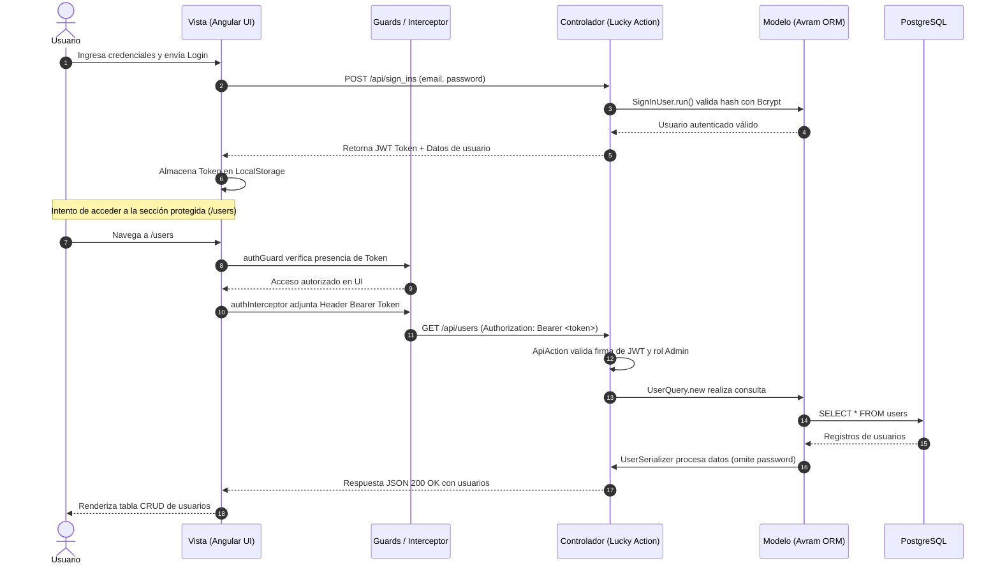

# CRUD MVC con Lucky y Angular


Aplicación web desarrollada bajo el patrón arquitectónico **Modelo-Vista-Controlador (MVC)** que implementa un sistema integral de **Autenticación (Login)** y un módulo protegido para la gestión de usuarios (**CRUD completo: Crear, Leer, Actualizar y Eliminar**).

El sistema cuenta con **seguridad de doble capa**: protección perimetral en cliente mediante *Guards* e interceptores HTTP en Angular, y validación estricta a nivel de servidor con *Tokens JWT*, *Bcrypt* y filtros de autorización en Lucky Framework.

---

## 📑 Tabla de Contenidos

1. [📹 Video Demostrativo](#-video-demostrativo)
2. [✨ Características del Proyecto](#-características-del-proyecto)
3. [🏛️ Arquitectura MVC y Flujo del Tech Stack](#️-arquitectura-mvc-y-flujo-del-tech-stack)
4. [🔒 Seguridad y Encriptación de Contraseñas](#-seguridad-y-encriptación-de-contraseñas)
5. [🛠️ Tecnologías Utilizadas (Tech Stack)](#️-tecnologías-utilizadas-tech-stack)
6. [📁 Estructura del Repositorio](#-estructura-del-repositorio)
7. [🚀 Instalación y Puesta en Marcha](#-instalación-y-puesta-en-marcha)
8. [🔑 Credenciales de Prueba](#-credenciales-de-prueba)

---

## 📹 Video Demostrativo
<p align="center">
  <a href="https://youtu.be/98zBya63qEE">
    
  </a>
</p>

---

## ✨ Características del Proyecto

[x] **Autenticación Robusta:** Flujo de inicio de sesión con generación de tokens JWT firmados ([`create.cr`](forgeworks_api/src/actions/api/sign_ins/create.cr) y [`auth.service.ts`](forgeworks-web/src/app/core/services/auth.service.ts)).

[x] **Rutas Protegidas (Doble Capa):**
  - **Frontend:** [`authGuard`](forgeworks-web/src/app/core/guards/auth.guard.ts) y [`adminGuard`](forgeworks-web/src/app/core/guards/admin.guard.ts) impiden el acceso a rutas sin token o sin rol de administrador.
  - **Backend:** `Api::Auth::RequireAuthToken` en [`api_action.cr`](forgeworks_api/src/actions/api_action.cr) rechaza solicitudes no autorizadas en cada endpoint del CRUD.

[x] **CRUD Completo de Usuarios:**
  - **Create (Crear):** Formulario para registrar nuevos usuarios con validación de datos ([`users.ts`](forgeworks-web/src/app/pages/users/users.ts) y [`create.cr`](forgeworks_api/src/actions/api/users/create.cr)).
  - **Read (Leer):** Listado general reactivo y visualización individual de detalles con modal SweetAlert2 ([`index.cr`](forgeworks_api/src/actions/api/users/index.cr) y [`read.cr`](forgeworks_api/src/actions/api/users/read.cr)).
  - **Update (Actualizar):** Modo de edición dinámico reutilizando el formulario de entrada ([`update.cr`](forgeworks_api/src/actions/api/users/update.cr)).
  - **Delete (Eliminar):** Eliminación controlada de registros en base de datos ([`delete.cr`](forgeworks_api/src/actions/api/users/delete.cr)).

[x] **Control de Acceso Basado en Roles (RBAC):** Separación de privilegios entre usuarios regulares y administradores ([`user.cr`](forgeworks_api/src/models/user.cr)).

[x] **Encriptación de Contraseñas:** Algoritmo de hashing seguro (Bcrypt) mediante `Authentic` en [`sign_up_user.cr`](forgeworks_api/src/operations/sign_up_user.cr), evitando el almacenamiento de contraseñas en texto plano.

---

## 🏛️ Arquitectura MVC y Flujo del Tech Stack

El sistema implementa de forma rigurosa la separación de responsabilidades del patrón **Modelo-Vista-Controlador (MVC)** desacoplado en dos capas modernas:

| Capa MVC | Tecnología | Archivos / Componentes Clave | Responsabilidad en la Solución |
| :--- | :--- | :--- | :--- |
| **🧠 Modelo (Model)** | **Avram ORM & Operations** *(Crystal)* | • [`user.cr`](forgeworks_api/src/models/user.cr)<br>• [`user_token.cr`](forgeworks_api/src/models/user_token.cr)<br>• [`sign_up_user.cr`](forgeworks_api/src/operations/sign_up_user.cr)<br>• [`update_user.cr`](forgeworks_api/src/operations/update_user.cr) | Define las entidades, tipos de datos, interacción con PostgreSQL, reglas de negocio y el hashing seguro de passwords con Bcrypt. |
| **👁️ Vista (View)** | **Angular SPA & Lucky Serializers** | • Login: [`login.ts`](forgeworks-web/src/app/pages/login/login.ts) / [`login.html`](forgeworks-web/src/app/pages/login/login.html)<br>• Users CRUD: [`users.ts`](forgeworks-web/src/app/pages/users/users.ts) / [`users.html`](forgeworks-web/src/app/pages/users/users.html)<br>• [`user_serializer.cr`](forgeworks_api/src/serializers/user_serializer.cr) | Renderiza la interfaz gráfica reactiva para el usuario y formatea las respuestas JSON de la API ocultando datos sensibles. |
| **🎮 Controlador (Controller)** | **Lucky Actions** *(Crystal)* | • [`api_action.cr`](forgeworks_api/src/actions/api_action.cr)<br>• [`sign_ins/create.cr`](forgeworks_api/src/actions/api/sign_ins/create.cr)<br>• Users Actions: [`index.cr`](forgeworks_api/src/actions/api/users/index.cr) \| [`create.cr`](forgeworks_api/src/actions/api/users/create.cr) \| [`read.cr`](forgeworks_api/src/actions/api/users/read.cr) \| [`update.cr`](forgeworks_api/src/actions/api/users/update.cr) \| [`delete.cr`](forgeworks_api/src/actions/api/users/delete.cr) | Recibe las peticiones HTTP, verifica tokens JWT, aplica filtros de autorización (`require_admin`) y coordina modelos y vistas. |

### El Flujo de una Petición Protegida



---

## 🔒 Seguridad y Encriptación de Contraseñas

En este proyecto se utilizó **Bcrypt**, el estándar de la industria recomendado sobre algoritmos obsoletos como MD5 o SHA-1:

1. **Hashing Unidireccional con Salt:** Al registrar un usuario en [`sign_up_user.cr`](forgeworks_api/src/operations/sign_up_user.cr), el shard `Authentic` ejecuta:
   ```crystal
   Authentic.copy_and_encrypt(password, to: encrypted_password)
   ```
2. **Protección en Base de Datos:** En el modelo [`user.cr`](forgeworks_api/src/models/user.cr), la columna en PostgreSQL se define como `column encrypted_password : String`. El valor original en texto plano nunca se persiste.
3. **Serialización Segura:** En [`user_serializer.cr`](forgeworks_api/src/serializers/user_serializer.cr), el campo `encrypted_password` está estrictamente excluido para garantizar que ningún hash viaje hacia el cliente.
4. **Verificación en Login:** En [`sign_in_user.cr`](forgeworks_api/src/operations/sign_in_user.cr), la contraseña ingresada se procesa contra el salt y hash almacenados; si coinciden, se emite un JSON Web Token (JWT) mediante [`user_token.cr`](forgeworks_api/src/models/user_token.cr).

---

## 🛠️ Tecnologías Utilizadas (Tech Stack)

### Backend (API REST MVC)
- **[Crystal Language](https://crystal-lang.org/):** Lenguaje compilado con sintaxis inspirada en Ruby y rendimiento equivalente a C.
- **[Lucky Framework (v1.5.0)](https://luckyframework.org/):** Framework web fullstack fuertemente tipado que previene errores en tiempo de compilación.
- **[Avram ORM](https://github.com/luckyframework/avram):** Mapeo objeto-relacional seguro contra inyecciones SQL.
- **[Authentic & JWT](https://github.com/luckyframework/authentic):** Sistema de hashing Bcrypt y gestión de tokens de sesión.

### Frontend (Single Page Application)
- **[Angular (v22)](https://angular.dev/):** Framework empresarial para aplicaciones web.
- **Angular Signals:** Manejo reactivo de estado para listas de usuarios y formularios.
- **Angular Router & Guards:** Control de acceso perimetral (`CanActivateFn`).
- **HTTP Client & Interceptors:** Inyección automática de tokens Bearer en cabeceras.
- **SweetAlert2:** Alertas y modales interactivos para visualización de detalles y confirmaciones.

### Base de Datos e Infraestructura
- **[PostgreSQL](https://www.postgresql.org/):** Sistema de gestión de bases de datos relacional.
- **Docker & Docker Compose:** Contenedores para base de datos y entorno de ejecución.

---

## 📁 Estructura del Repositorio

```
forgeworks/
│
├── forgeworks_api/                      # ⚙️ BACKEND (Lucky Framework MVC)
│   ├── config/                          # Configuración de base de datos y servidor
│   ├── db/
│   │   ├── migrations/                  # Migraciones de base de datos
│   │   └── seed/                        # Semillas de datos iniciales
│   └── src/
│       ├── actions/                     # 🎮 CONTROLADORES (Actions)
│       │   ├── api_action.cr            # Base controller (AuthToken & RequireAdmin)
│       │   └── api/
│       │       ├── sign_ins/create.cr   # Endpoint de Login (POST /api/sign_ins)
│       │       └── users/               # Endpoints del CRUD (/api/users)
│       ├── models/                      # 🧠 MODELOS (Entidades Avram)
│       │   ├── user.cr                  # Modelo de Usuario y Roles
│       │   └── user_token.cr            # Generación y validación de JWT
│       ├── operations/                  # Lógica de Negocio y Validaciones
│       │   ├── sign_in_user.cr          # Verificación de credenciales
│       │   ├── sign_up_user.cr          # Creación y hashing de passwords
│       │   └── update_user.cr           # Actualización de datos
│       └── serializers/                 # 👁️ VISTAS JSON
│           └── user_serializer.cr       # Formateo de respuesta sin campos sensibles
│
├── forgeworks-web/                      # 🎨 FRONTEND (Angular)
│   └── src/app/
│       ├── core/
│       │   ├── guards/                  # 🛡️ Protección de Rutas
│       │   │   ├── auth.guard.ts        # Bloquea navegación a usuarios no autenticados
│       │   │   └── admin.guard.ts       # Valida rol administrativo
│       │   ├── interceptors/
│       │   │   └── auth.interceptor.ts  # Inyecta Bearer token en cada request HTTP
│       │   └── services/
│       │       ├── auth.service.ts      # Manejo de sesión y LocalStorage
│       │       └── user.service.ts      # Consumo de endpoints CRUD
│       └── pages/                       # 👁️ VISTAS (Componentes UI)
│           ├── login/                   # Interfaz de inicio de sesión
│           └── users/                   # Interfaz completa del CRUD de usuarios
│
└── README.md                            # Documentación principal del proyecto
```

---

## 🚀 Instalación y Puesta en Marcha

### Prerrequisitos
- **Crystal** `>= 1.20.0` y **Lucky CLI**
- **Node.js** `>= 18.x` y **npm**
- **PostgreSQL** `>= 14.x` (o Docker)

---

### Paso 1: Clonar el repositorio
```bash
git clone https://github.com/tu-usuario/forgeworks.git
cd forgeworks
```

---

### Paso 2: Configurar y Levantar el Backend (`forgeworks_api`)

1. Navegar a la carpeta del backend:
   ```bash
   cd forgeworks_api
   ```
2. Instalar dependencias de Crystal:
   ```bash
   shards install
   ```
3. Configurar variables de entorno (crear archivo `.env` si es necesario):
   ```bash
   # Configuración por defecto de PostgreSQL
   DB_HOST=localhost
   DB_PORT=5432
   DB_USERNAME=postgres
   DB_PASSWORD=postgres
   ```
4. Crear la base de datos y ejecutar las migraciones:
   ```bash
   lucky db.create
   lucky db.migrate
   ```
5. Iniciar el servidor API (por defecto en el puerto `3000`):
   ```bash
   lucky dev
   # o alternativamente:
   crystal run src/forgeworks_api.cr
   ```

---

### Paso 3: Configurar y Levantar el Frontend (`forgeworks-web`)

1. Abrir una nueva terminal y navegar a la carpeta web:
   ```bash
   cd forgeworks-web
   ```
2. Instalar paquetes de npm:
   ```bash
   npm install
   ```
3. Iniciar el servidor de desarrollo de Angular:
   ```bash
   ng serve
   ```
4. Abrir en el navegador:
   ```
   http://localhost:4200
   ```

---

## 🔑 Credenciales de Prueba

Para facilitar la evaluación de la entrega y las pruebas del sistema, puede utilizar los siguientes datos de acceso:

| Rol | Correo Electrónico | Contraseña | Permisos / Acceso |
| :--- | :--- | :--- | :--- |
| **Administrador** | `admin@forgeworks.com` | `password123` | Acceso completo al Login y al CRUD protegido (`/users`) |

---
<div align="center">

### Sara Chiriboga
*Estudiante de Ingeniería de Software · Universidad de las Américas*

[](www.linkedin.com/in/sara-chiriboga-112bb33ba)
[](https://github.com/sarilola)
[](https://github.com/SaraChiriboga)
[](https://discordapp.com/users/1141563506152448090)

💬 *¿Tienes alguna duda sobre la arquitectura de este proyecto? ¡Conectemos!*

</div>


